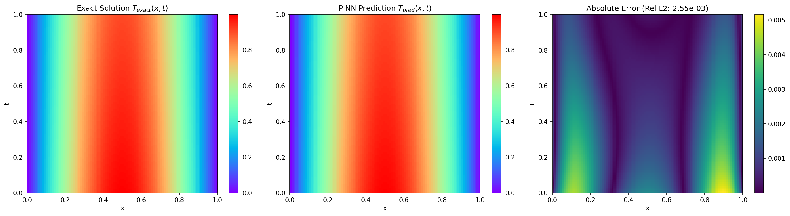
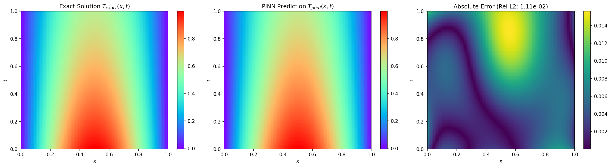
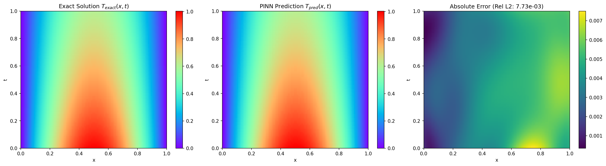
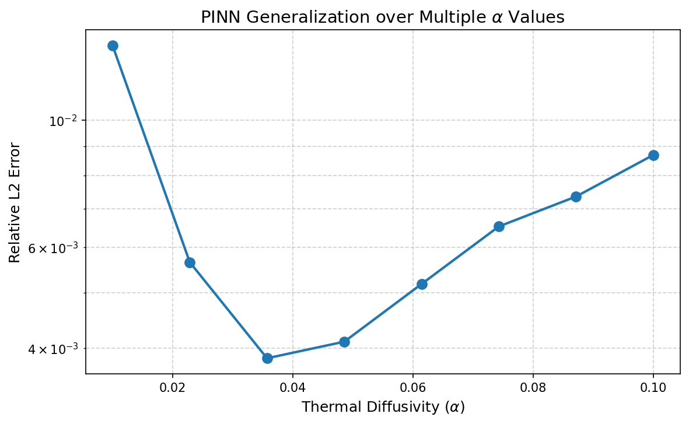
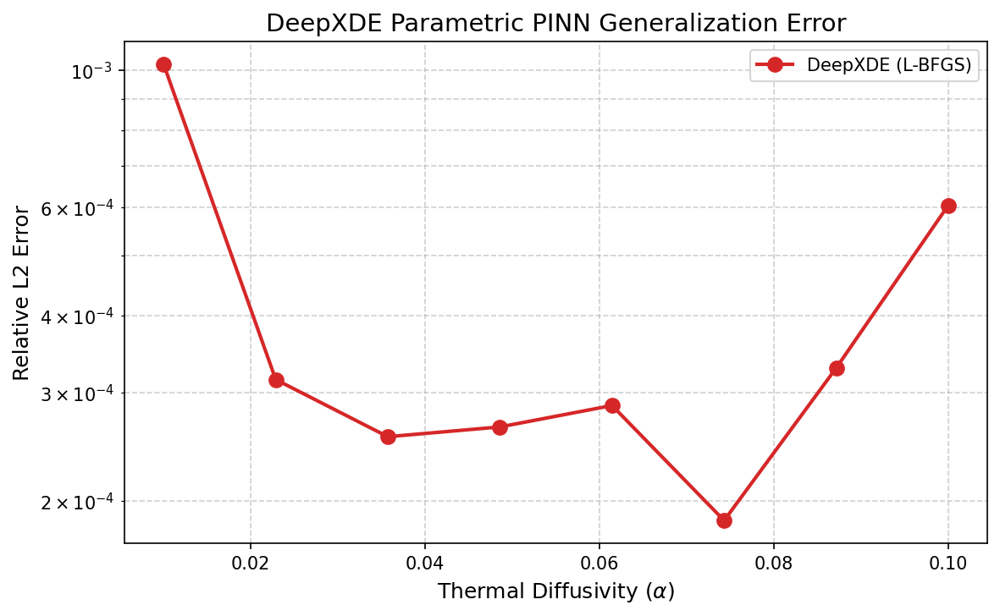
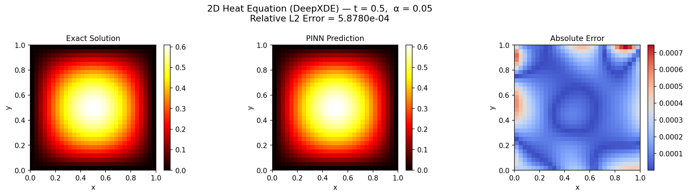

# PINNsStudy

这是一个围绕物理信息神经网络（PINNs）的分阶段学习与实验仓库。项目主线从 `PyTorch Autograd` 的高阶导数计算出发，逐步推进到 1D 热传导方程、参数化 PINN、多 `alpha` 泛化验证、GPU 迁移，以及 `DeepXDE` 框架下的 1D/2D 热方程建模。

当前仓库的直接目标，是为后续飞秒激光诱导表面形貌（LIPSS）轻量化代理模型打基础。现阶段代码主要聚焦“可验证、可视化、可逐步推导”的热传导原型问题。

## 项目主线

仓库严格围绕 [`Plan.md`](Plan.md) 中的四阶段路线推进，并将阶段性理解沉淀到 [`Note.md`](Note.md)。

| Phase | 核心主题 | 代表脚本 | 目标 |
| --- | --- | --- | --- |
| Phase 1 | Autograd 与高阶导数 | `2026.2.22/mlp_basics.py` `2026.2.27/antograd_derivatives.py` | 搞清楚输入导数、一阶导、二阶导和计算图连续性 |
| Phase 2 | 1D 热传导方程 PINN | `2026.2.27/heat_equation_pinn.py` `2026.2.28/weight_experiment.py` | 跑通 PDE Loss、IC、BC 的联合训练与权重平衡 |
| Phase 3 | 参数化 PINN 与代理模型 | `2026.2.28/parametric_pinn.py` `2026.3.1/multi_alpha_validation.py` `2026.3.1/multi_alpha_validation_GPU.py` | 将热扩散系数 `alpha` 升级为网络输入，验证跨参数泛化能力 |
| Phase 4 | DeepXDE 工业级框架 | `2026.3.5/heat_deepxde_basic.py` `2026.3.5/heat_deepxde_parametric.py` `2026.3.5/heat_deepxde_2d.py` | 用声明式方式重构 PDE、边界条件、采样与训练流程 |

## 仓库结构

```text
PINNsStudy/
├── Plan.md                         # PINNs 四阶段学习与开发计划
├── Note.md                         # 阶段性物理推导、API 笔记、实验结论
├── 2026.2.22/
│   └── mlp_basics.py               # 最小 MLP 骨架
├── 2026.2.27/
│   ├── antograd_derivatives.py     # Autograd 一阶/二阶导数示例
│   ├── heat_equation_pinn.py       # 1D 热传导方程 PINN
│   └── heat_equation_result.png    # Phase 2 结果图
├── 2026.2.28/
│   ├── weight_experiment.py        # Loss 权重平衡实验
│   ├── parametric_pinn.py          # 参数化 1D 热传导 PINN
│   ├── heat_equation_result.png    # 阶段复现结果图
│   └── parametric_pinn_result.png  # 参数化 PINN 结果图
├── 2026.3.1/
│   ├── multi_alpha_validation.py   # 多 alpha 泛化验证 + 数据损失 + 重采样
│   ├── multi_alpha_validation_GPU.py
│   └── multi_alpha_error.png       # 多 alpha 误差曲线
└── 2026.3.5/
    ├── heat_deepxde_basic.py       # DeepXDE 入门版
    ├── heat_deepxde_resample.py    # DeepXDE 重采样教学骨架
    ├── heat_deepxde_parametric.py  # DeepXDE 参数化 PINN
    ├── heat_deepxde_2d.py          # DeepXDE 2D 热传导方程
    ├── deepxde_multi_alpha_error.png
    └── heat_2d_error.png
```

## 关键问题与物理对象

### 1. 1D 热传导方程

```text
dT/dt = alpha * d²T/dx²
```

- 空间域：`x in [0, 1]`
- 时间域：`t in [0, 1]`
- 初始条件：`T(x, 0) = sin(pi * x)`
- 边界条件：`T(0, t) = 0, T(1, t) = 0`

### 2. 参数化热传导方程

```text
输入: (x, t, alpha)
输出: T(x, t, alpha)
```

这里的核心思想不是“再解一个单独 PDE”，而是让网络一次性学习一族解，从而具备代理模型能力。

### 3. 2D 热传导方程

```text
dT/dt = alpha * (d²T/dx² + d²T/dy²)
```

这是从 1D 空间域扩展到 2D 空间域的进阶版本，用于验证高维几何、二维 Hessian 和 DeepXDE 回调机制。

## 环境依赖

仓库当前没有提供 `requirements.txt`，按脚本内容至少需要以下库：

- `torch`
- `numpy`
- `matplotlib`
- `deepxde`

一个最小安装示例：

```bash
pip install torch numpy matplotlib
pip install deepxde
```

说明：

- 手写 PINN 脚本依赖 `PyTorch`。
- `DeepXDE` 脚本需要你本地已经为 DeepXDE 配好对应后端。
- `2026.3.1/multi_alpha_validation_GPU.py` 需要可用的 CUDA 版 PyTorch 才能真正跑在 GPU 上。

## 建议阅读与运行顺序

建议先读文档，再按 Phase 顺序运行脚本。

### 1. 先看文档

```bash
open Plan.md
open Note.md
```

如果你不想用图形界面，也可以直接在终端里看：

```bash
sed -n '1,200p' Plan.md
sed -n '1,260p' Note.md
```

### 2. 再按阶段运行

```bash
python 2026.2.22/mlp_basics.py
python 2026.2.27/antograd_derivatives.py
python 2026.2.27/heat_equation_pinn.py
python 2026.2.28/weight_experiment.py
python 2026.2.28/parametric_pinn.py
python 2026.3.1/multi_alpha_validation.py
python 2026.3.1/multi_alpha_validation_GPU.py
python 2026.3.5/heat_deepxde_parametric.py
python 2026.3.5/heat_deepxde_2d.py
```

## 脚本状态说明

| 脚本 | 角色 | 说明 |
| --- | --- | --- |
| `2026.2.22/mlp_basics.py` | 入门骨架 | 最小 MLP，用于建立张量流动直觉 |
| `2026.2.27/antograd_derivatives.py` | Phase 1 核心示例 | 演示 `autograd.grad` 的一阶和二阶导数 |
| `2026.2.27/heat_equation_pinn.py` | Phase 2 基线实验 | 第一个完整可运行的 1D 热传导 PINN |
| `2026.2.28/weight_experiment.py` | Phase 2 调参实验 | 比较等权、失衡权重、自适应权重的影响 |
| `2026.2.28/parametric_pinn.py` | Phase 3 基础版 | 将 `alpha` 提升为网络输入 |
| `2026.3.1/multi_alpha_validation.py` | Phase 3 完整版 | 加入多 `alpha` 泛化验证、数据损失与动态重采样 |
| `2026.3.1/multi_alpha_validation_GPU.py` | 工程迁移版 | 训练逻辑不变，迁移到 GPU 设备 |
| `2026.3.5/heat_deepxde_basic.py` | DeepXDE 入门练习 | 偏教学型脚本，保留了引导式注释 |
| `2026.3.5/heat_deepxde_resample.py` | DeepXDE 回调练习 | 偏教学骨架，用于理解重采样与双阶段优化 |
| `2026.3.5/heat_deepxde_parametric.py` | DeepXDE 参数化版本 | 用 DeepXDE 重构多 `alpha` 代理模型 |
| `2026.3.5/heat_deepxde_2d.py` | DeepXDE 2D 版本 | 从 1D 扩展到 2D 空间域 |

## 阶段性结果

根据 [`Note.md`](Note.md) 中已经记录的实验结论，这个仓库当前完成了以下几个关键里程碑：

- Phase 2 中，1D 热传导方程 PINN 已经稳定收敛，相对 L2 误差达到 `1.14e-03` 量级。
- Loss 权重实验表明，这个基础问题上等权组合已经接近最优，盲目放大某一项损失会明显拉差整体误差。
- Phase 3 中，参数化 PINN 已具备跨 `alpha in [0.01, 0.1]` 的泛化能力，并观察到了典型的 U 型误差分布。
- Phase 4 中，项目已经迁移到 `DeepXDE`，并扩展到了 2D 热传导方程；笔记中记录的 2D 相对 L2 误差达到 `5.88e-04` 量级。

## 结果图集

### Phase 2: 1D 热传导方程基线结果

`2026.2.27/heat_equation_pinn.py`



### Phase 2: 阶段复现结果图

`2026.2.28/heat_equation_result.png`



### Phase 3: 参数化 PINN 结果

`2026.2.28/parametric_pinn_result.png`



### Phase 3: 多 alpha 泛化误差曲线

`2026.3.1/multi_alpha_error.png`



### Phase 4: DeepXDE 参数化 PINN 泛化误差

`2026.3.5/deepxde_multi_alpha_error.png`



### Phase 4: DeepXDE 2D 热传导方程结果

`2026.3.5/heat_2d_error.png`



## 文档关系

- [`Plan.md`](Plan.md)：回答“接下来学什么”
- [`Note.md`](Note.md)：回答“已经学会了什么、踩过哪些坑”
- `README.md`：回答“这个仓库是什么、怎么跑、看哪些结果图”

## 下一步方向

从仓库当前进度看，热传导方程这一条训练链路已经基本跑通。后续可以继续沿着下面的方向推进：

- 将 `alpha` 扩展为更多材料或工艺参数，逐步逼近 LIPSS 代理模型的真实输入空间
- 从解析解监督过渡到 COMSOL 或实验数据驱动
- 在 DeepXDE 或手写 PyTorch 框架中继续尝试更复杂的多物理场残差构建
